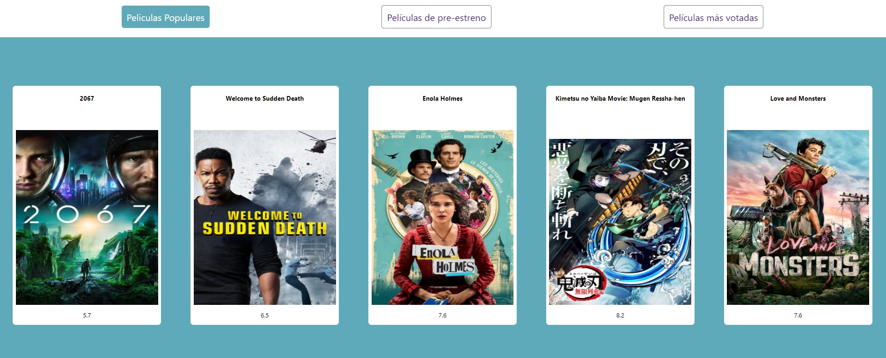

### React Movie App

#### - Instalar dependencias
```
yarn install
```


#### - Arranque de cliente de ReactJS
```
yarn start
```
Url de acceso: [http://localhost:3000](http://localhost:3000)
####
#### - API consumida [The Movie Database](https://www.themoviedb.org/)

#### - Navegación
- La página de entrada presenta 3 botones en el menú
    - Películas populares
    - Películas de pre-estreno
    - Películas más votadas
- Una vez pulsado cada botón, se muestra un listado personalizado en cada caso en formato tarjeta.

#### - Mejoras
- Se podrían aplicar filtros de búsqueda personalizados y mejorar los estilos así como una página de entrda más adecuada.
- El proyecto se adapta a pantallas grandes, no estando implementado para el uso en dispositivo móvil ya que no era el objetivo de esta prueba técnica.
Nota: Entre mis repos dispongo de otros proyectos adaptables a dispositivos móviles.

#### - Captura del proyecto

